# GW2 Elite Insights Parser

[](https://github.com/baaron4/GW2-Elite-Insights-Parser)
[](https://baaron4.github.io/GW2-Elite-Insights-Parser/Json/index.html)

[](https://github.com/baaron4/GW2-Elite-Insights-Parser/releases/latest)
[](https://github.com/baaron4/GW2-Elite-Insights-Parser/issues)
[](https://github.com/baaron4/GW2-Elite-Insights-Parser/releases/latest)

[](https://github.com/baaron4/GW2-Elite-Insights-Parser/graphs/contributors)
[](https://github.com/baaron4/GW2-Elite-Insights-Parser/forks)
[](https://github.com/baaron4/GW2-Elite-Insights-Parser/watchers)
[](https://github.com/baaron4/GW2-Elite-Insights-Parser/stargazers)

## Contact
For general ArcDPS-related discussions and troubleshooting, including ArcDPS, ArcDPS addons, or EVTC log parsing, please join our Discord server.

[](https://discord.gg/T4kSbKJ5Sf)

The key for verifying the release's signature can be found on [openpgp](https://keys.openpgp.org/search?q=CC2A0529D3469F39A6155C73FA6E8DECE596BCE9).

## Logging

We suggest following [this guide](https://snowcrows.com/guides/arcdps/arcdps) written by Snow Crows on how to setup your ArcDPS installation and generate logs.

## Set Up

### Requirements
- .NET8.0 

You will be prompted to install .NET on Windows if you don't already have it, on Linux and MacOS please follow the instructions [here](https://dotnet.microsoft.com/en-us/download/dotnet/8.0) you only need the ASP.NET Core Runtime.

> [!IMPORTANT]  
> .NET8.0 will reach end of life in November 2026. The November release will start using .NET10.0 you can find it [here](https://dotnet.microsoft.com/en-us/download/dotnet/10.0)

### UI
#### Windows
1. Download the appropriate version zip file for your OS and architecture from the [latest release](https://github.com/baaron4/GW2-Elite-Insights-Parser/releases/latest). Don't forget to check regularly to stay updated or simply click `Check EI Updates` (we have a channel that notifies new releases on our discord).
2. Extract all files anywhere you like.
3. Launch `GuildWars2EliteInsights.exe`.

> [!NOTE]
> ArcDPS EVTC log files are located by default at `"C:\Users\<USERNAME>\Documents\Guild Wars 2\addons\arcdps\arcdps.cbtlogs"`.

#### Linux
1. Follow steps 1 & 2 from above.
2. Open the folder in the terminal.
3. Run `chmod +x ./GuildWars2EliteInsights` to mark it as an executable.
4. You can now double click the file to launch it or simply start it with `./GuildWars2EliteInsights`.

#### MacOS
1. Follow all the Linux steps.
2. After trying to open `GuildWars2EliteInsights` and Apple will issue a warning. 
3. Click `Done` and navigate to Privacy & Security scroll to the bottom.
4. Click `Open Anyway` for `GuildWars2EliteInsights`.
5. Try to Open `GuildWars2EliteInsights` again Apple will issue another warning.
6. In Privacy & Security click on `Allow Anyway` for `libAvaloniaNative.dylib`.
7. Launch `GuildWars2EliteInsights` and click on `Open Anyway` when prompted. 

### CLI
1. Download `GW2EICLI.zip` from the [latest release](https://github.com/baaron4/GW2-Elite-Insights-Parser/releases/latest).
2. Extract all files anywhere you like.
3. Optionally add it to the PATH of your OS.

## UI Usage
<div style="display: flex;">
   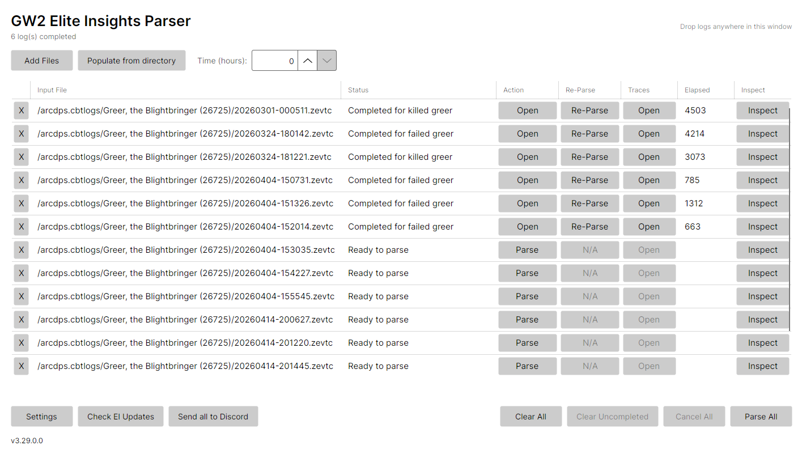
   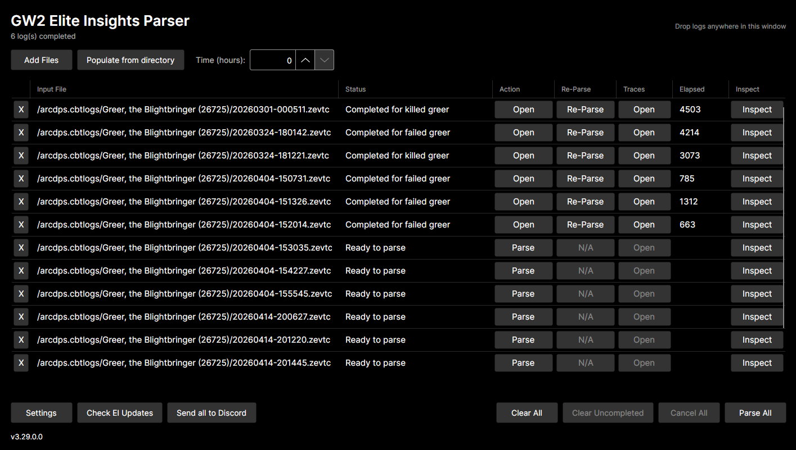
</div>
<br>

1. Use either `Add Files` or `Populate from directory` buttons or drag and drop anywhere on the window one or multiple .evtc, .evtc.zip, or .zevtc files onto the program.

2. Click `Parse`.

3. Click `Open` when parsing done.

You can use the Settings window to modify the parser output. The settings changes will not be applied to logs already parsing.

## Console Usage

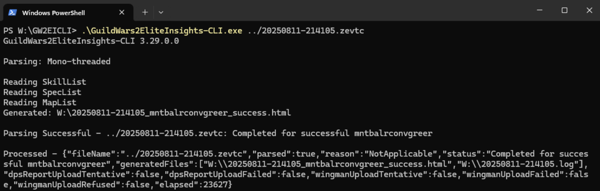

Settings can be configured using .conf files (see `Settings/sample.conf` for an example). You can then use it with `-c`.

### For console

The `-populate_from` option will automatically fetch files from that path.

Using `-discord_batch`, you can send dps.report links to a valid discord webhook.

With the `-watch` option, the application will watch given path in order to parse logs files added under it.

You can refresh the API caches using the `-cache` option.

You can update EI to its latest version using the `-update` option.

Use `-h` to display the help message.

#### Windows
```
.\GuildWars2EliteInsights-CLI.exe -c [config path] [logs]
```

#### Linux/MacOS

```
dotnet ./GuildWars2EliteInsights-CLI.dll -c [config path] [logs]
```

For every input, CLI will consistently output a JSON like object, preceded by "Processed - ". The object will contain the following attributes:

-__fileName__: string, name of the file that was parsed.

-__parsed__: boolean, set to true if parsing was successful.

-__reason__: string, only relevant when "parsed" is false. Indicates the reason why the parsing has failed. In "Setting", "User", "FileContent" and "Fatal".

-__status__: string, as displayed on the application on UI mode once processing is done.

-__generatedFiles__: array of string, full name of all created files.

-__dpsReportUploadTentative__: boolean, if true, the application tried to upload to dps.report.

-__dpsReportUploadFailed__: boolean, if true, the application could not upload to dps.report.

-__dpsReportLink__: string, dps.report URL of the log, if applicable.

-__wingmanUploadTentative__: boolean, if true, the application tried to upload to wingman.

-__wingmanUploadRefused__: boolean, if true, wingman refused to accept the file.

-__wingmanUploadFailed__: boolean, if true, wingman accepted the file but the upload failed.

-__elapsed__: integer, time spent processing in milliseconds.

> [!NOTE]
> It may take some time for each file to parse and they will not be ready to open the moment they are created.

## Settings
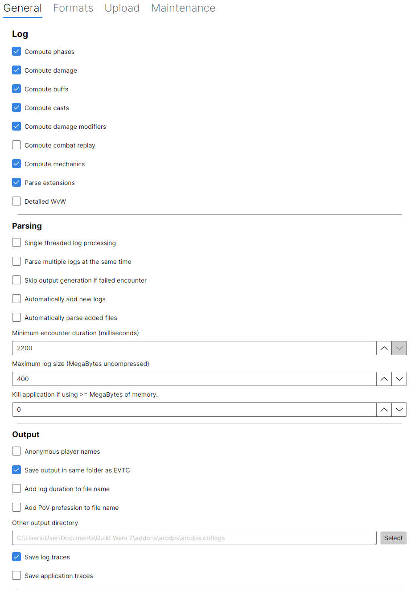

### Output Settings

-__SaveAtOut__: if true, the generated files will be in the same location as the source file.

-__OutLocation__: secondary output path, will be used if SaveAtOut is false.

-__SaveOutTrace__: if true, log files will be generated.

-__Anonymous__: if true, player character and account names will be obfuscated.

-__AddPoVProf__: if true, the profession of the pov will be added to the generated files' name.

-__AddDuration__: if true, the duration (truncated to seconds) will be added to the generated files' name.

### Parser Settings

-__SingleThreaded__: if true, only a single thread will be used for parsing a single log.

-__ParseMultipleLogs__: if true, multiple logs will be parsed in parallel.

-__SkipFailedTries__: if true, failed logs will not be parsed.

-__CustomTooShort__: Customize log duration in ms below which logs will not be parsed.

### GUI only Parser Settings

-__AutoAdd__: if true, EI will automatically add logs that appear in AutoAddPath.

-__AutoAddPath__: the path to listen to for automatic additions.

-__AutoParse__: if true, every added log file will be automatically processed.

### Log Settings

-__ParsePhases__: if true, phases will be parsed.

-__ParseCombatReplay__: if true, combat replay will be computed.

-__ComputeBuff__: if true, buff related stats will be computed.

-__ComputeDamage__: if true, damage related stats will be computed.

-__ComputeCast__: if true, skill cast related stats will be computed.

-__ComputeMechanics__: if true,mechanics will be computed.

-__ComputeDamageModifiers__: if true, damage modifiers will be computed. This also requires all three ComputeBuff, ComputeDamage and ComputeCast to be true.

-__ParseExtensions__: if true, extension events present in the evtc will be processed.

-__DetailledWvW__: if true, enemy players will not be merged into one in WvW logs and they'll appear as standard targets. Warning: the generated files and the generation time will grow exponentially, use it only on organized sorties (Guild zergs, GvG, ...).

### HTML settings

-__SaveOutHTML__: if true, html logs will be generated.

-__HtmlExternalScripts__: if true, css and js files will be separated from the html.

-__HtmlExternalScriptsPath__: Available if HtmlExternalScripts is enabled. Fill in an absolute path to place the external script files at a different location than the report file. If you use this tool on a server and wish to populate reports directly remember to set valid path in __HtmlExternalScriptsCdn__. Otherwise users might not be able to open the external scripts within your report.

-__HtmlExternalScriptsCdn__: Available if HtmlExternalScripts is enabled. Will use an url for the external script files. Generate once, use multiple times. Will reduce needed webspace a bit. If this option is set the settings of __HtmlExternalScriptsPath__ will not be used to include external sources. Think about CORS if you use a separate server for static source files.

-__LightTheme__: if true, the html will use a light theme by default. Please note that the theme can be dynamically changed on the html post generation.

-__HtmlCompressJson__: if true, the input json of the html will be compressed (roughly %60 gain in size).

### CSV Settings

-__SaveOutCSV__: if true, csv logs will be generated.

### Raw Format Settings

-__SaveOutJSON__: if true, json logs will be generated.

-__IndentJSON__: if true, generated json logs will be indented instead of being on a single line.

-__CompressRaw__: if true, xml and json logs will be compressed.

-__RawTimelineArrays__: if true, xml and json logs will contain graph related data.

### Upload Settings

-__UploadToDPSReports__: if true, the log will be uploaded to dps.reports using EI as generator.

-__DPSReportUserToken__: dps.report user token.

-__UploadToWingman__: if true, the log will be uploaded to Wingman via the "uploadProcessed" endpoint.

-__WebhookURL__: Webhook URL to send an embed or simple message to.

-__SendEmbedToWebhook__: if true, the Webhook URL will receive a small embed containing meta data + dps.reports link.

-__SendSimpleMessageToWebhook__: if true, only the dps.reports link will be sent to the webhook.

### General Settings

-__MemoryLimit__: In MB. If the application uses more RAM than provided number, the application will exit with code 2. 0 to disable the feature. When enabled, the maximum between given number and 100 MB will be used.

## HTML Overview

For a more detailed look, please check [this guide](https://snowcrows.com/guides/arcdps/reading-logs) written by Snow Crows.

### Header

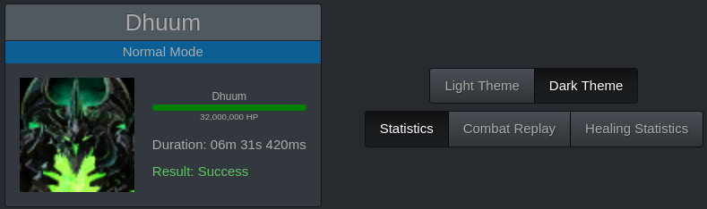
  
The header shows you the status of the fight and lets you swap themes and modules. There are three modules available: Statistics, Combat Replay and Healing Statistics.

### Footer

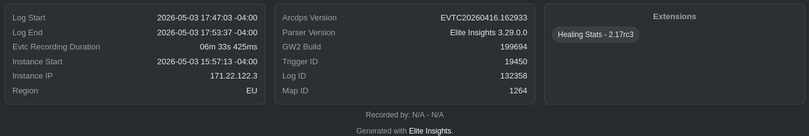

On the footer you'll find meta data regarding the log and the parser.

### Statistics
#### Navigation

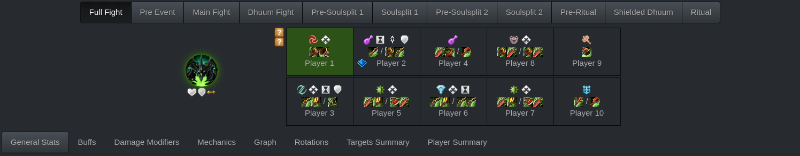

This panel is where the main navigation of the Statistics module will happen, you can select targets, players, phases and components. 

The target selection will impact what you'll observe on every panel that has a "Target" section.

On players, you can observe gear related scores (between 0 and 10, please check "question mark" for a detailed explanation on how this value is computed), used weapons and the commander tag (if applicable).

#### General Stats
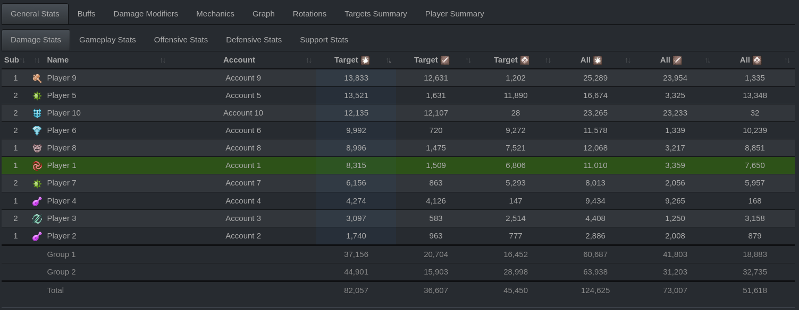

On general stats you can see macro statistics regarding incoming/outgoing damage and player behavior:
- "Damage Stats" contains outgoing damage related information.
- "Gameplay Stats" contains generic information like time spent casting or not casting skills, average distance to the commander player, etc...
- "Offensive Stats" contains secondary player information like critical hit rates, flaking rates, number of time one's attack was blocked/absorbed, etc...
- "Defensive Stats" contains incoming damage related information.
- "Support Stats" contains boon strips, conditions removal, resurrection and related information.

#### Buffs

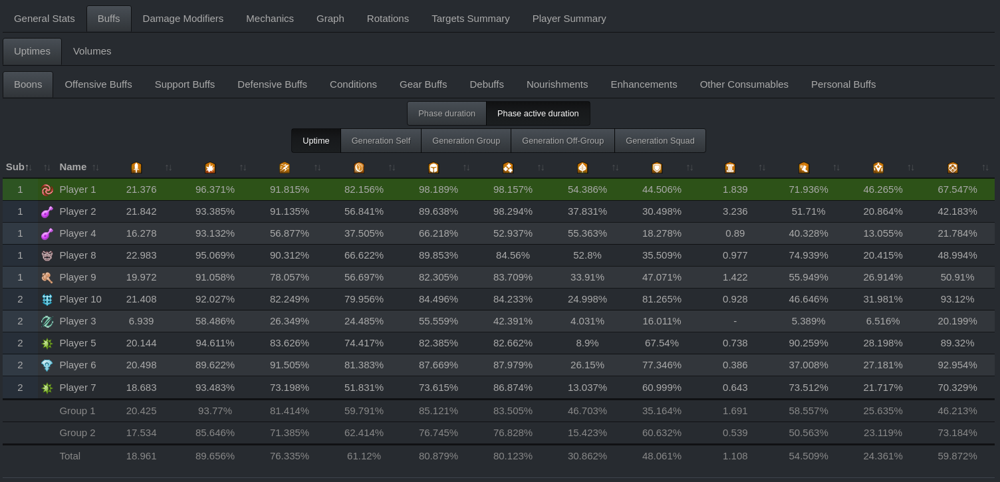

This component will show you buff uptimes, ordered by categories, and generation information for each player.

On generation tables, please check the "question mark" above for a detailed explanation of the meaning of the tooltips.

#### Damage Modifiers

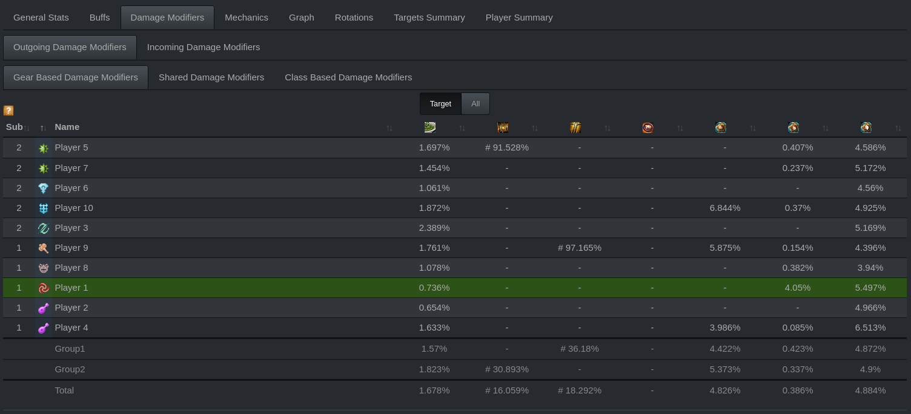

This component contains damage modifiers, ordered by categories.

The modifiers are categorised by outgoing and incoming, then further split into gear based, shared and class based modifiers.

Damage modifiers with a positive value indicate that the player dealt or taken increased damage, negative value means the opposite.

Please note that it is not possible to check traits or gear which means that Elite Insights will assume that every gear and trait based damage modifiers are present. Buff based damage modifiers are only shown if present.

#### Mechanics

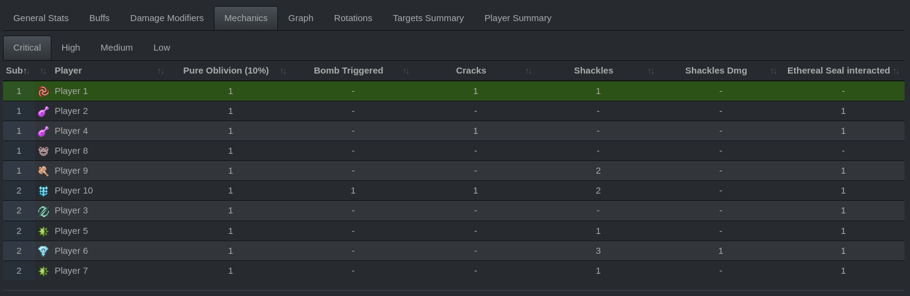

A very straightforward component that contains a summary of important fight specific mechanics.

Depending on the nature of the mechanic, the column can be considered just as informative, a success or a failure.

#### Graph

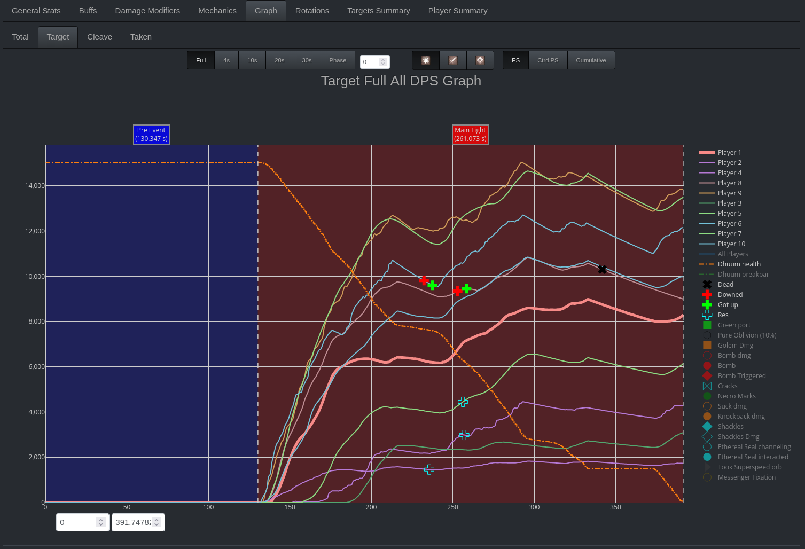

Damage graph that also contains enemy health, enemy breakbar and fight mechanics information. The graph is fully interactive and can be exported. Shown damage can also be customized:
- The time interval in between the information is computed
- The nature of the information:
   - DPS in [x - interval, x].
   - DPS in [x - interval / 2, x + interval / 2].
   - Cumulative damage in [x - interval, x].

#### Rotations

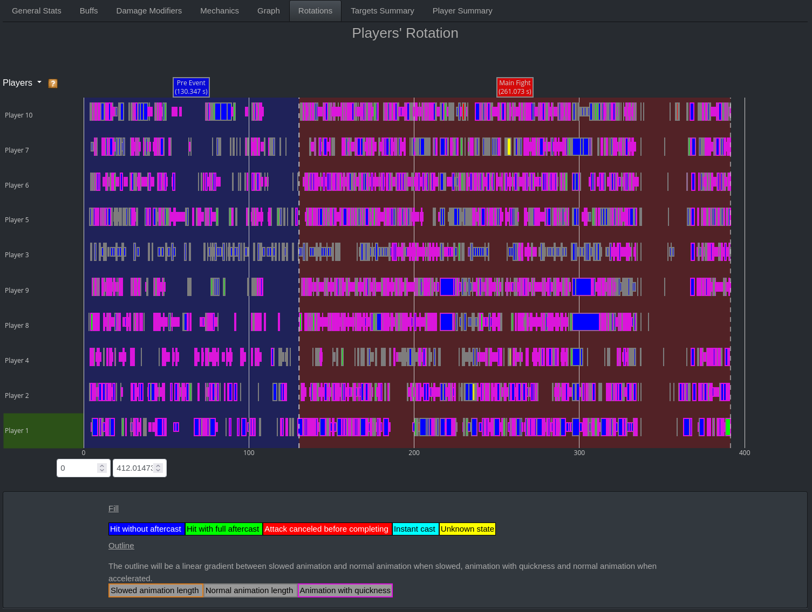

This component displays each players rotation based on the timeline of the fight, it also highlights the different phases of the encounter and you can zoom in on a specific section simply by left clicking and dragging to either side.

Hovering over any of the skills will display:
- Name
- Timestamp 
- Duration

#### Targets Summary

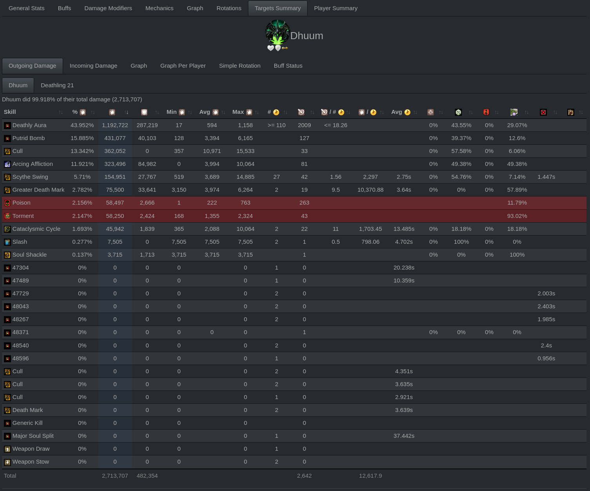

This component focuses on the selected target:
- Outgoing damage distribution per skill for the target and its minions.
- Incoming damage distribution per skill.
- Graph that contains outgoing damage, health, breakbar, rotation and buff presences. The graph is fully interactive and can be exported. Damage related customizations on the main graph are also applicable here.
- The same graph as above but filtered to a specific player
- Customizable simple rotation component for a tidier look on skill ordering.
- Buff status contains condition and boon uptimes on the boss. For conditions, it is also possible to see generation done by each player.

#### Player Summary

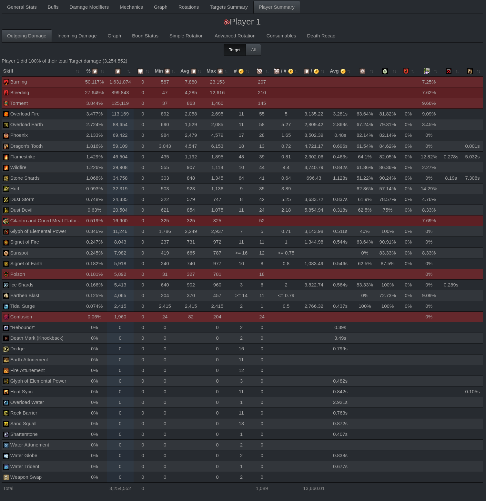

This component focuses on the selected target in the selected phase:
- Outgoing damage distribution per skill for the player and their minions.
- Incoming damage distribution per skill for the player and their minions.
- Graph that contains outgoing damage, health, rotation and buff presences. Information related to targets' health and breakbar can also be displayed. The graph is fully interactive and can be exported. Damage related customizations on the main graph are also applicable here.
- Boon uptimes and volumes for the player.
- Customizable simple rotation component for a tidier look on skill ordering.
- Advanced rotation for the player, you can zoom in on a specific 60 second section simply by left clicking and dragging to either side.
- Information on the consumables used by the player.
- A succession of small graphs that details incoming damage before each death.

### Combat Replay

#### Main Display

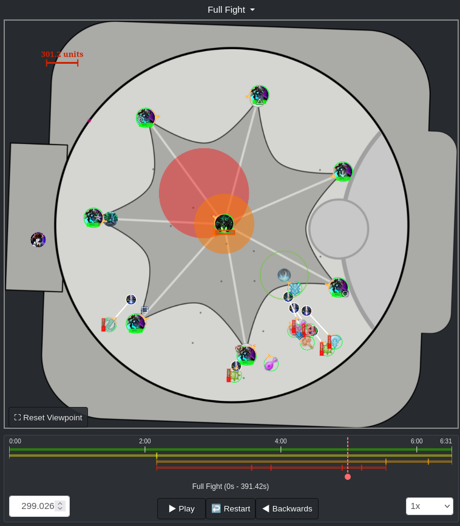

The main display is where the animation happens.

It is possible to control the animation speed and jump to specific fight phases.

The display supports two manipulations: Pan and Zoom.

#### Damage Table

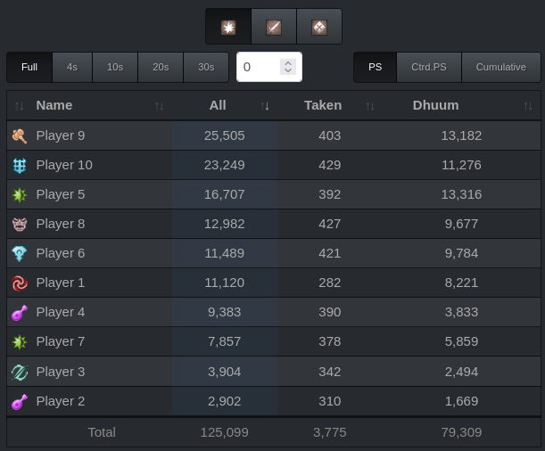

Displays damage/DPS in real time. The picture says it all.

#### Selection

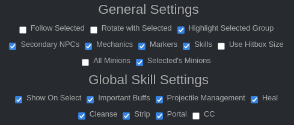

Allows to display or remove specific information from the Combat Replay such as:
- Follow selected player
- Group highlights
- Secondary NPCs
- Mechanics
- Markers
- Player Skills
- Use in-game hitbox sizes
- Show all minions
- Show selected's minions

Player skills displayed are categorised in the following groups:
- Show on select: displays only when the player is selected
- Important buffs: skill that applies an important buff such as Stability
- Projectile Management: skill that can reflect or destroy projectiles
- Heal: healing skill
- Cleanse: condition removal skill
- Strip: boon removal skill
- Portal: a portal skill such as Mesmer's Open Portal, Scourge's Sand Swell, Thief's Shadow Portal, etc...
- CC: crowd control Skill

#### Indicators

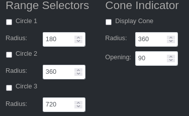

With this panel you can customize the display further by adding range indicators and cone indicators on the selected player.

#### Players & Targets

<div style="display: flex; gap: 16px;">
   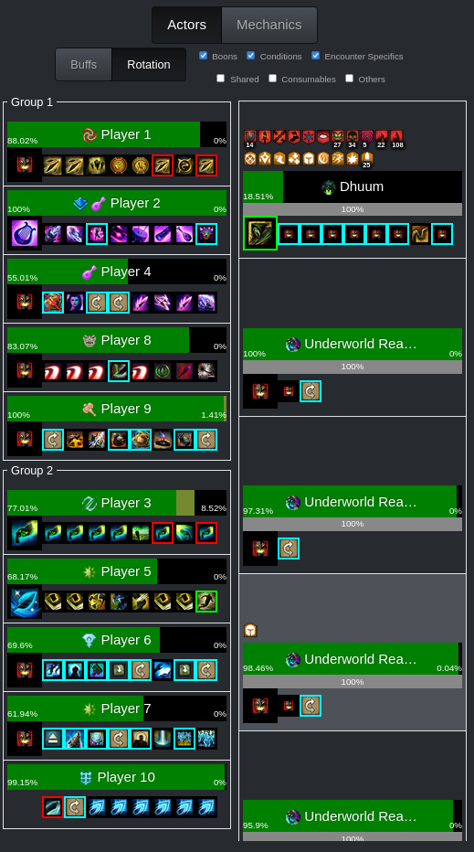
   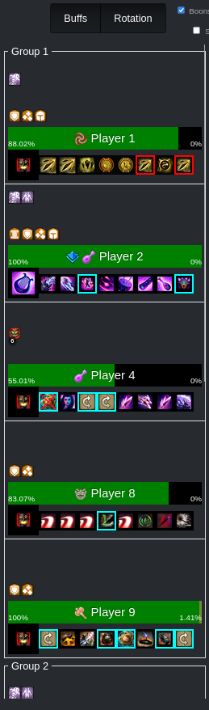
</div>
<br/>

This component lets you interact with Players and Targets.

Once a player or target is selected, they will appear with a green square around on the main display.

When selecting a player if "Highlight Selected Group" is checked, players on the same group will have a blue square around them.

For players we can observe:
- Health and Barrier
- Present buff/debuffs
- Skill casts

For targets we can observe:
- Health and Barrier
- Breakbar state and select a breakbar phase
- Present buff/debuffs
- Skill casts

#### Mechanics

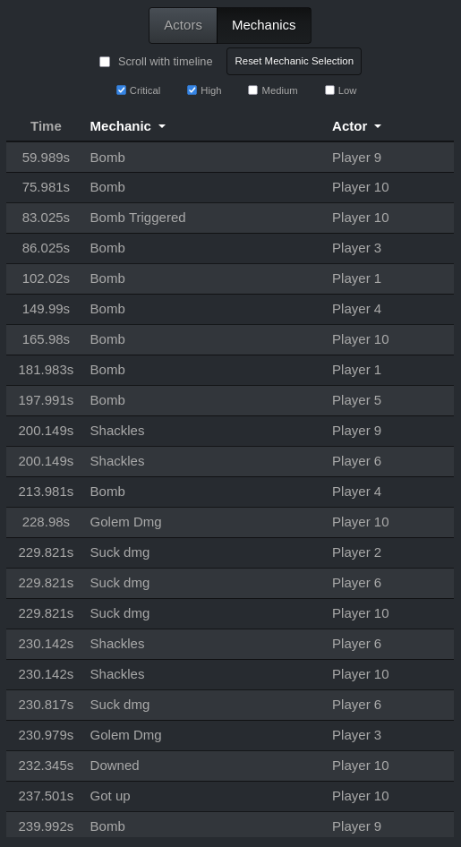

With this table, you can directly jump on the timestamp of a specific mechanic.

It is possible to filter the table by:
- The type of the mechanic
- The actor involved

### Healing Statistics

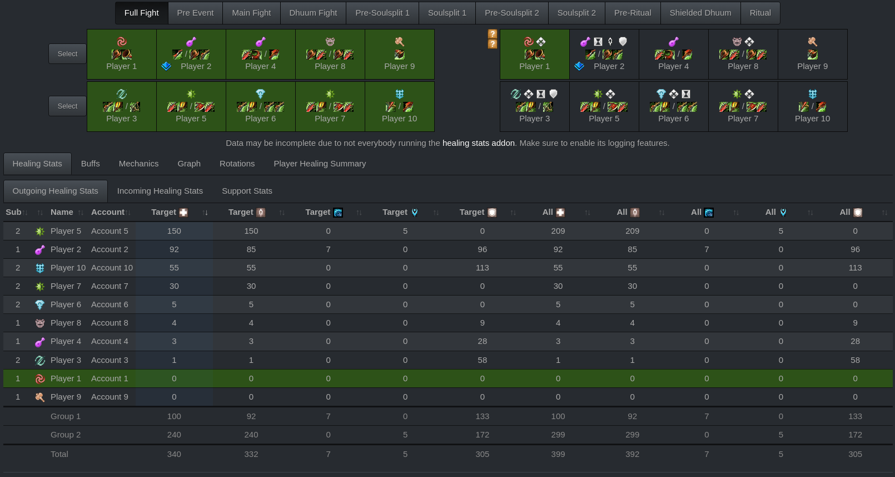

Elite Insights fully supports healing statistics through the [ArcDPS Healing Stats Extension](https://github.com/Krappa322/arcdps_healing_stats).

Download and install this extenstion to gain access to healing statistics. Read their README for further information.

## JSON Overview 

The JSON documentation can be found [here](https://baaron4.github.io/GW2-Elite-Insights-Parser/Json/index.html).

## EVTC Inspector


The EVTC Inspector allows you to inspect metadata and events that occurred during the encounter.

Selecting any entry from the tables in Events, Agents Data or Skills Data will display the detailed information about it. 

The table columns can be sorted and resized and selecting a row and using `Ctrl + c` will copy all of the columns for the row.

### Events
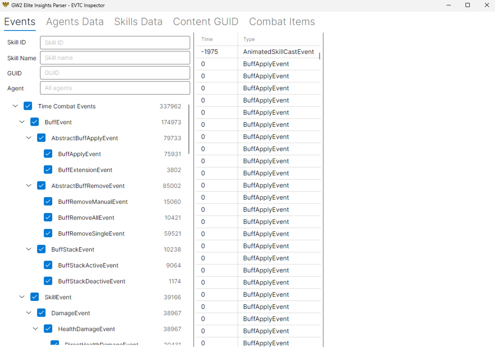

Contains every event that occured during the encounter, can be filtered by a specific Skill, content GUID or Agent and you can select which event types you would like to include/exclude from the table with the event tree. You can click an event in the list to inspect its content.

### Agents data

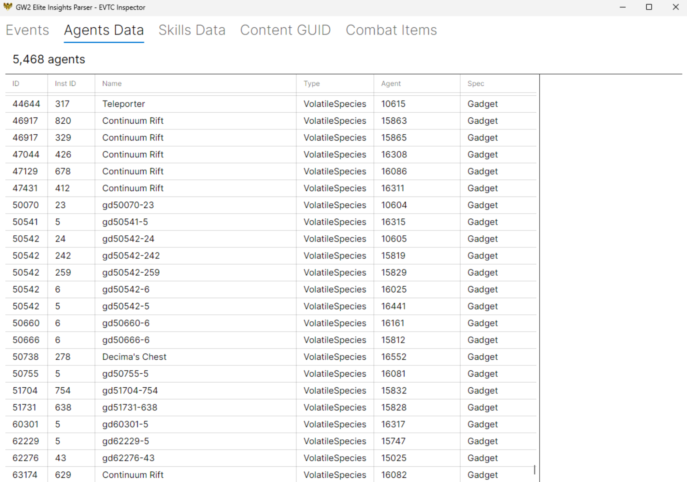

Contains information about every agent in the encounter: players, minions, npcs, mobs, etc..., can be filtered by ID, Name, Type, Spec and Base Spec.


### Skills data
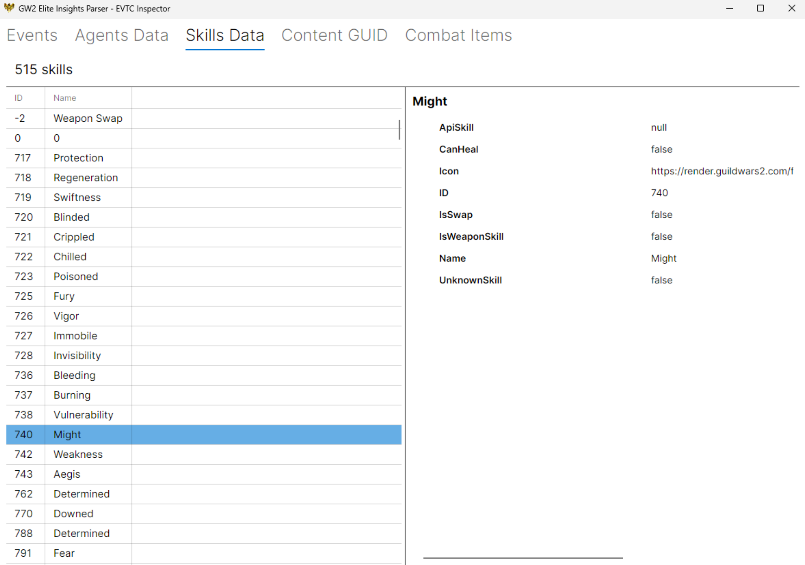

Contains metadata information about every skill that was used in the encounter, can be filtered by Name.

### Content GUID
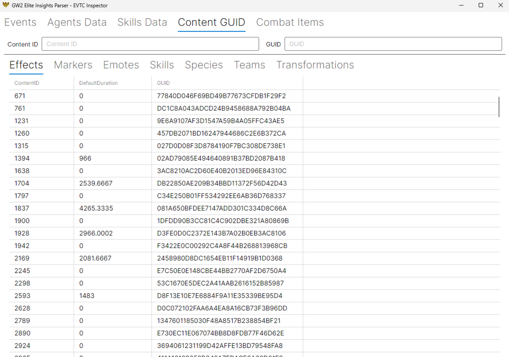

Contains their ContentID and GUID for different types of events, can be filtered by either ID to find the corresponding ID.

### Combat Items
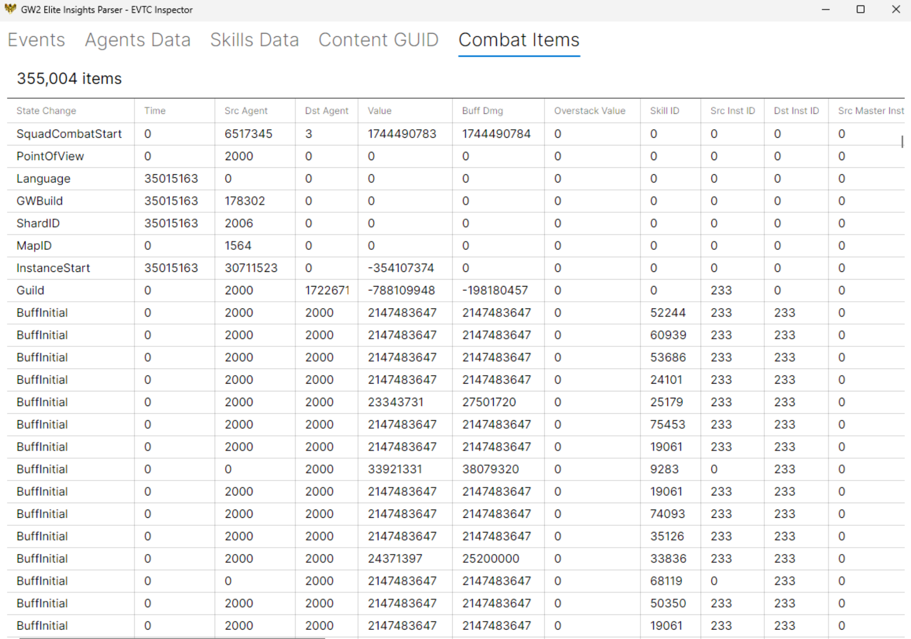

Table containing detailed information about every combat event that happened in the encounter, can be filtered by State Change.


## Contributors

Thank you to all our [contributors](https://github.com/baaron4/GW2-Elite-Insights-Parser/graphs/contributors).

Special thanks to Linus and TBTerra for creating images for the Combat Replay arenas.
