# Contact
The following discord is used for general ArcDPS related discussions and troubleshooting, whether we are talking about ArcDPS, ArcDPS addons or EVTC log parsing:

https://discord.gg/dCDEPXx

Our GitHub Page: https://baaron4.github.io/GW2-Elite-Insights-Parser/

# GW2-Elite-Insights-Parser
## Set Up

1. Go to Release section.

2. Download the GW2EI.zip file from the latest release. Don't forget to check regularly to stay updated (we have a channel that notifies new releases on our discord).

3. Extract all files anywhere you like.

4. Launch GW2EI.exe (UI or console).

NOTE: ArcDPS log files are currently located within "C:\Users\<USERNAME>\Documents\Guild Wars 2\addons\arcdps\arcdps.cbtlogs"
## UI Usage
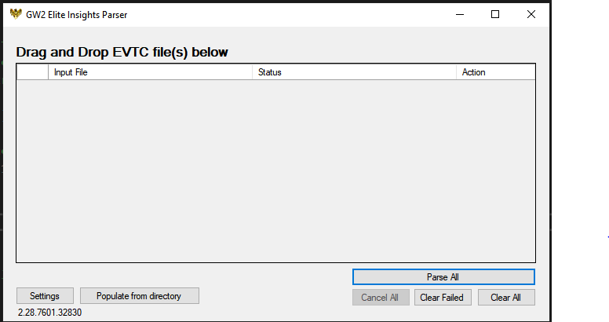

1. Drag and drop 1 or multiple .evtc, .evtc.zip or .zevtc files into program.

2. Click parse.

3. Click open when parsing done.

You can change the settings at any time using the Settings window.

## Console Usage


If you would like to have your logs parsed without the GUI pass the file location of each evtc file as a string. 

Settings can be configured using .conf files (see Settings/sample.conf for an example). You can then use it with -c:

```
GuildWars2EliteInsights.exe -c [config path] [logs]
```

To disable windows-specific commandline magic you can use -p:

```
GuildWars2EliteInsights.exe -p [logs]
```

You can also start the application in GUI mode using -ui option:
```
GuildWars2EliteInsights.exe -c [config path] -ui [logs]
```

Note it may take some time for each file to parse and they will not be ready to open the moment they are created.

## Settings
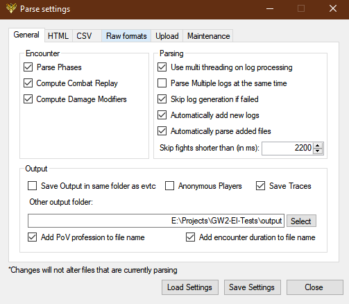
### Output Settings

-__SaveAtOut__: if true, the generated files will be in the same location as the source file.

-__OutLocation__: secondary output path, will be used if SaveAtOut is false.

-__Anonymous__: if true, player character and account names will be obfuscated.

-__AddPoVProf__: if true, the profession of the pov will be added to the generated files' name.

-__AddDuration__: if true, the duration (truncated to seconds) will be added to the generated files' name.

### Parser Settings

-__MultiThreaded__: if true, multiple threads will be used for parsing a single log.

-__ParseMultipleLogs__: if true, multiple logs will be parsed in parallel.

-__SaveOutTrace__: if true, log files will be generated.

-__SkipFailedTries__: if true, failed encounters will not be parsed.

### GUI only Parser Settings

-__AutoAdd__: if true, EI will automatically add logs that appear in AutoAddPath.

-__AutoAddPath__: the path to listen to for automatic additions.

-__AutoParse__: if true, every added log file will be automatically processed.

### Encounter Settings

-__ParsePhases__: if true, phases will be parsed.

-__ParseCombatReplay__: if true, combat replay will be computed.

-__ComputeDamageModifiers__: if true, damage modifiers will be computed.

### HTML settings

-__SaveOutHTML__: if true, html logs will be generated.

-__HtmlExternalScripts__: if true, css and js files will be separated from the html.

-__LightTheme__: if true, the html will use a light theme by default. Please note that the theme can be dynamically changed on the html post generation.

### CSV Settings

-__SaveOutCSV__: if true, csv logs will be generated.

### Raw Format Settings

-__SaveOutJSON__: if true, json logs will be generated.

-__IndentJSON__: if true, generated json logs will be indented instead of being on a single line.

-__SaveOutXML__: if true, xml logs will be generated.

-__IndentXML__: if true, generated xml logs will be indented instead of being on a single line.

-__CompressRaw__: if true, xml and json logs will be compressed.

-__RawTimelineArrays__: if true, xml and json logs will contain graph related data.

### Upload Settings

-__UploadToDPSReports__: if true, the log will be uploaded to dps.reports using EI as generator.

-__DPSReportUserToken__: dps.report user token.

-__UploadToDPSReportsRH__: if true, the log will be uploaded to dps.reports using RH as generator.

-__UploadToRaidar__: if true, the log will be uploaded to raidar (not used).

-__WebhookURL__: Webhook URL to send an embed or simple message to.

-__SendEmbedToWebhook__: if true, the Webhook URL will receive a small embed containing meta data + dps.reports link.

-__SendSimpleMessageToWebhook__: if true, only the dps.reports link will be sent to the webhook.

## HTML Overview

### Header


The header shows you the status of the fight and let's you swap themes and modules. Right now, only two modules are available: Statistics and Combat Replay.

### Footer

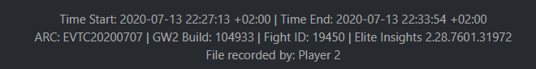

On the footer you'll find meta data regarding the encounter and the parser.

### Statistics
#### Navigation

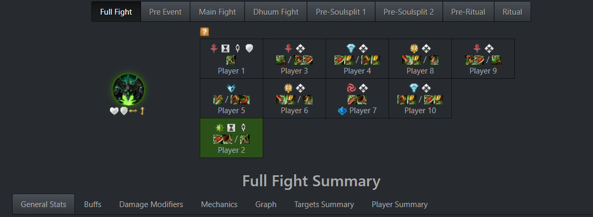

This panel is where the main navigation of the Statistics module will happen, you can select targets, players, phases and components. 

The target selection will impact what you'll observe on every panel that has a "Target" section.

On players, you can observe gear related scores (between 0 and 10, please check "question mark" for a detailled explanation on how this value is computed), used weapons and the commander tag (if applicable).

#### General Stats
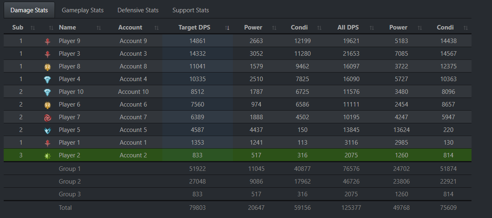

On general stats you can see macro statistics regarding incoming/outgoing damage and player behavior:
- "Damage Stats" contains outgoing damage related information.
- "Gameplay Stats" contains secondary player information like critical hit rates, flaking rates, number of time one's attack was blocked/absorbed, etc...
- "Defensive Stats" contains incoming damage related information.
- "Support Stats" contains boon strip and condition removal related information.

#### Buffs

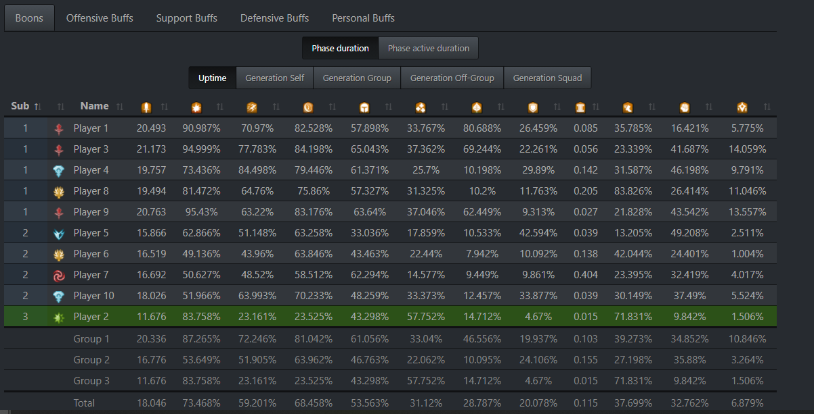

This component will show you buff uptimes, ordered by categories, and generation information for each players.

On generation tables, please check the "question mark" above for a detailled explanation of the meaning of the tooltips.

#### Damage Modifiers

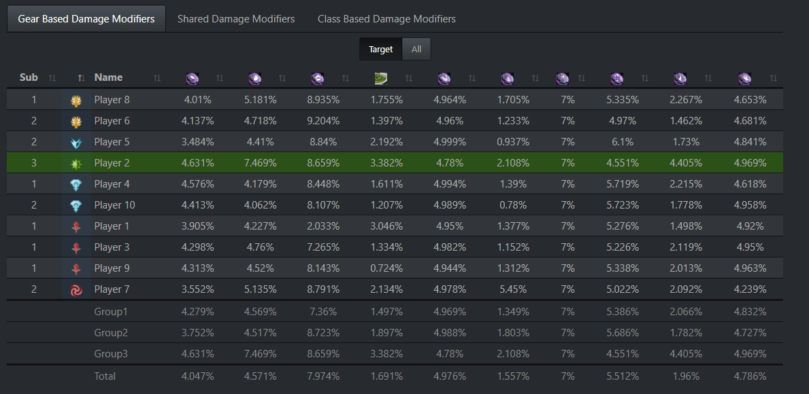

This component contains damage increases by modifiers, ordered once again by categories. 

Please note that it is not possible to check traits or gear which means that Elite Insights will assume that every gear and trait based damage modifiers are present. Buff based damage modifiers are only shown if present.

#### Mechanics

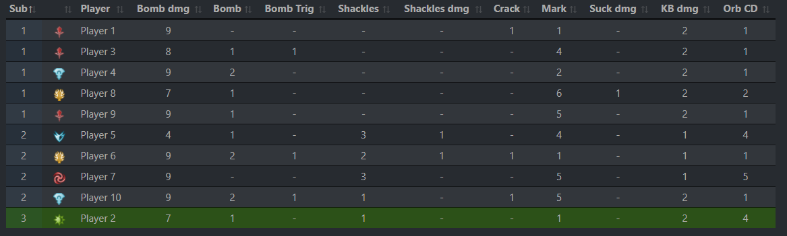

A very straightforward component that contains a summary of important fight specific mechanics.

Depending on the nature of the mechanic, the column can be considered just as informative, a success or a failure.

#### Graph

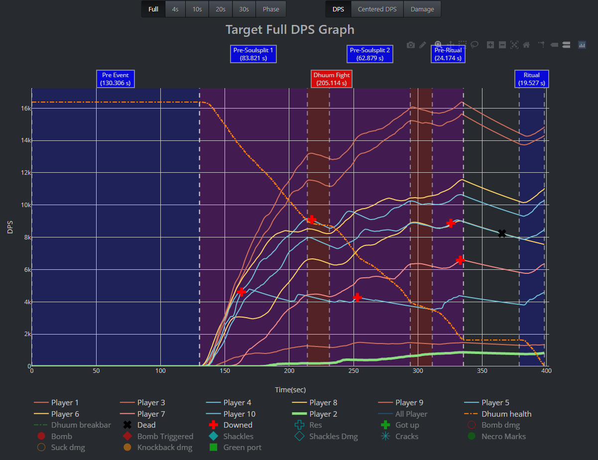

Damage graph that also contains enemy health, enemy breakbar and fight mechanics information. The graph is fully interactive and can be exported. Shown damage can also be customized:
- The time interval in between the information is computed
- The nature of the information:
   - DPS in [x - interval, x].
   - DPS in [x - interval / 2, x + interval / 2].
   - Cumulative damage in [x - interval, x].

#### Targets Summary

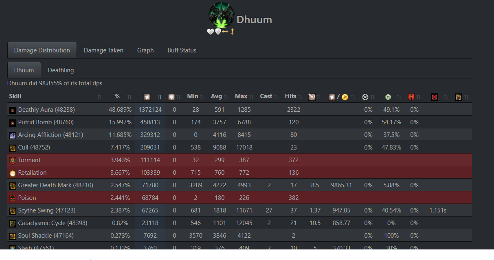

This component focuses on the selected target:
- Outgoing damage distribution per skill for the target and its minions.
- Incoming damage distribution per skill.
- Graph that contains outgoing damage, health, breakbar, rotation and buff presences. The graph is fully interactive and can be exported. Damage related customizations on the main graph are also applicable here.
- Buff status contains condition and boon uptimes on the boss. For conditions, it is also possible to see generation done by each player.

#### Player Summary

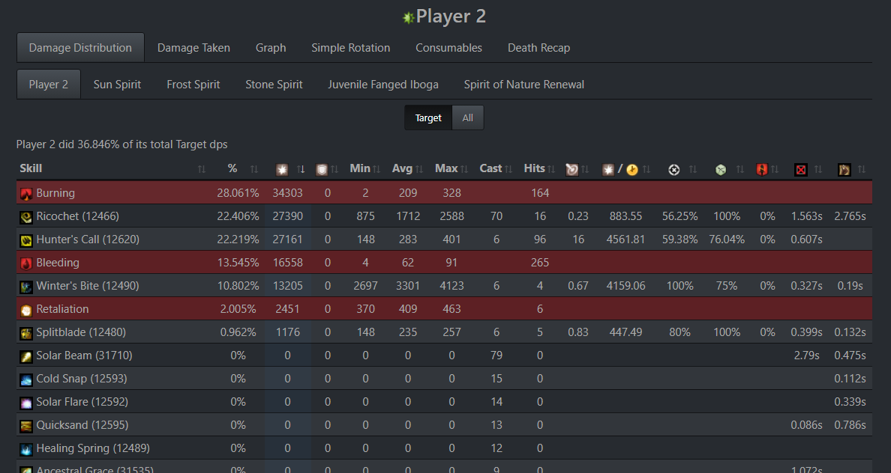

This component focuses on the selected target:
- Outgoing damage distribution per skill for the player and their minions.
- Incoming damage distribution per skill.
- Customizable simple rotation component for a tidier look on skill ordering.
- Graph that contains outgoing damage, health, rotation and buff presences. Information related to targets' health and breakbar can also be displayed. The graph is fully interactive and can be exported. Damage related customizations on the main graph are also applicable here.
- Information on the consumables used by the player.
- A succession of small graphs that details incoming damage before each death.

### Combat Replay

#### Main Display

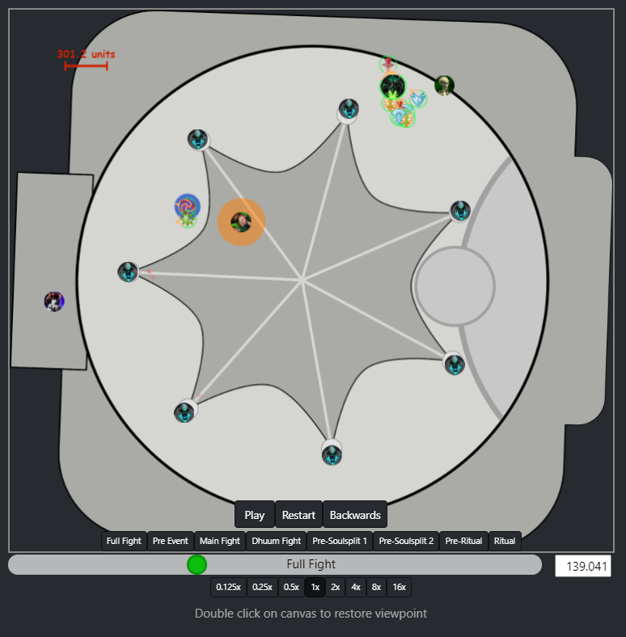

The main display is where the animation happens.

It is possible to control animation speed and jump into specific fight phases.

The display supports two manipulations: Pan and Zoom.

#### Damage Table

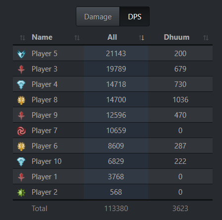

Displays damage/DPS in real time. The picture says it all.

#### Selection

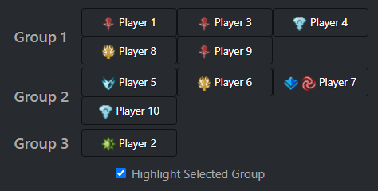

This component lets you select a specific player. Once a player is selected, they will appear with a green square around on the main display. 

If "Highlight Selected Group" is checked, players on the same group as the selected player will have a blue square around them.

#### Indicators


With this panel you can customize the display further by adding range indicators and cone indicators on the selected player.

#### Players

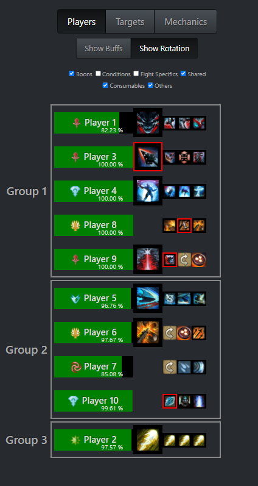

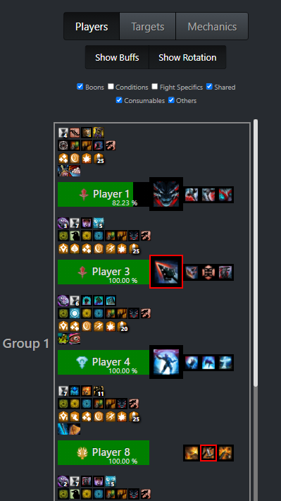

#### Targets

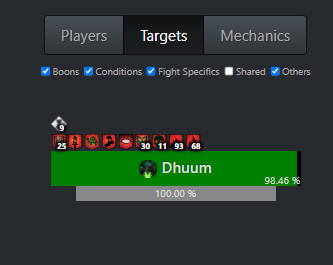

On this component you can observe the status of currently active targets. The status includes:
- Health
- Breakbar
- Present buff/debuffs

#### Mechanics


With this table, you can directly jump on the timestamp of a specific mechanic.

It is possible to filter the table by:
- The type of the mechanic
- The actor involved

## JSON Overview 

The Json documentation can be found [here](https://baaron4.github.io/GW2-Elite-Insights-Parser/Json/index.html)

# Contributors
## Developers
- baaron4
- EliphasNUIT
- cordbleibaum
- QuiCM
- amgine
- Linus
- Sejsel
- Flomix
- Stonos
- Hobinjk

## Other stuffs
- Linus (arena maps/ icons for combat replay)


